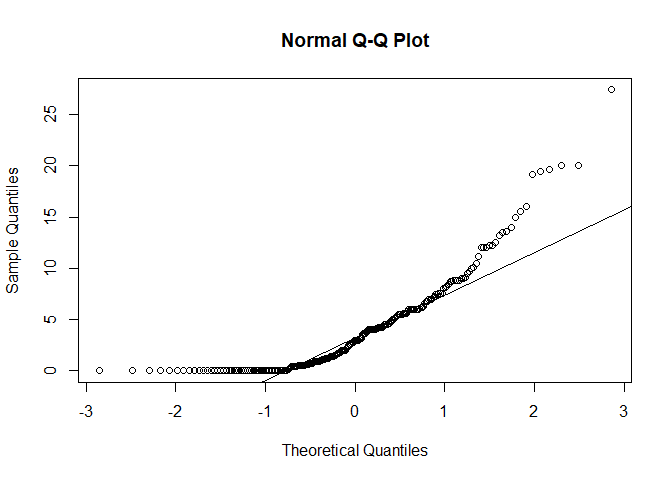

# Prediction of Coronary Heart Disease(CHD) using South African Heart Disease Data
Shantam Gupta  
February 16, 2017  


#1. 
 Data preparation and exploration
(a) Select the training set: Download the data. Partition the dataset into a training
and a validation subsets of equal size, by randomly selecting rows in the training
set.
(b) Data exploration: Consider the training set only. Report one-variable summary
statistics, two-variable summary statistics, and discuss your findings (e.g., presence
of highly correlated predictors, categorical predictors, missing values, outliers etc).

```r
x <-read.csv("https://web.stanford.edu/~hastie/ElemStatLearn/datasets/SAheart.data",header = T)

#checking for missing valaues in x 
x[is.na(x),]
```

```
##  [1] row.names sbp       tobacco   ldl       adiposity famhist   typea    
##  [8] obesity   alcohol   age       chd      
## <0 rows> (or 0-length row.names)
```

```r
x <- x[,-1]
#no missing values found in dataset
set.seed(100)

#splitting the dataset into 50% train and  50 % test data
train <- x[sample(x=1:nrow(x), size=nrow(x)*.5),]
test <- x[!(rownames(x) %in% rownames(train)),]

#one variable summary
summary(train)
```

```
##       sbp           tobacco           ldl           adiposity    
##  Min.   :101.0   Min.   : 0.00   Min.   : 0.980   Min.   : 8.66  
##  1st Qu.:126.0   1st Qu.: 0.40   1st Qu.: 3.575   1st Qu.:20.57  
##  Median :134.0   Median : 3.00   Median : 4.590   Median :26.47  
##  Mean   :139.6   Mean   : 4.11   Mean   : 4.949   Mean   :26.04  
##  3rd Qu.:150.0   3rd Qu.: 6.00   3rd Qu.: 6.085   3rd Qu.:31.40  
##  Max.   :218.0   Max.   :27.40   Max.   :15.330   Max.   :42.49  
##     famhist        typea          obesity         alcohol       
##  Absent :144   Min.   :20.00   Min.   :14.70   Min.   :  0.000  
##  Present: 87   1st Qu.:47.00   1st Qu.:23.39   1st Qu.:  0.685  
##                Median :54.00   Median :25.92   Median :  8.330  
##                Mean   :53.29   Mean   :26.20   Mean   : 18.991  
##                3rd Qu.:60.00   3rd Qu.:28.40   3rd Qu.: 26.025  
##                Max.   :77.00   Max.   :45.72   Max.   :144.000  
##       age             chd       
##  Min.   :15.00   Min.   :0.000  
##  1st Qu.:34.00   1st Qu.:0.000  
##  Median :48.00   Median :0.000  
##  Mean   :44.66   Mean   :0.368  
##  3rd Qu.:57.00   3rd Qu.:1.000  
##  Max.   :64.00   Max.   :1.000
```

```r
dim(train)
```

```
## [1] 231  10
```

```r
str(train)
```

```
## 'data.frame':	231 obs. of  10 variables:
##  $ sbp      : int  128 150 161 124 134 164 148 126 160 140 ...
##  $ tobacco  : num  2.8 3.5 9 4 0 0.5 8.2 0.54 0.6 0.6 ...
##  $ ldl      : num  5.53 6.99 4.65 12.42 2.4 ...
##  $ adiposity: num  14.3 25.4 15.2 31.3 21.1 ...
##  $ famhist  : Factor w/ 2 levels "Absent","Present": 1 2 2 2 1 2 2 2 1 2 ...
##  $ typea    : int  64 50 58 54 57 47 46 45 36 58 ...
##  $ obesity  : num  25 23.4 23.8 23.2 22.4 ...
##  $ alcohol  : num  0.51 23.48 43.2 2.06 1.37 ...
##  $ age      : int  38 61 46 42 18 46 64 25 64 55 ...
##  $ chd      : int  0 1 0 1 0 1 1 0 0 1 ...
```

```r
#famhist is a qualitaive predictors so replacing Absent with 0 and Present with 1
levels(train$famhist) <- c(0,1)
train$famhist <- as.numeric(train$famhist)


levels(test$famhist) <- c(0,1)
test$famhist <- as.numeric(test$famhist)


#pairwise correlation
c<-cor(train)
c
```

```
##                   sbp     tobacco         ldl   adiposity     famhist
## sbp        1.00000000  0.30265936  0.09167979  0.33085348 0.076198463
## tobacco    0.30265936  1.00000000  0.15704369  0.33827528 0.015532673
## ldl        0.09167979  0.15704369  1.00000000  0.38120611 0.120779694
## adiposity  0.33085348  0.33827528  0.38120611  1.00000000 0.135004870
## famhist    0.07619846  0.01553267  0.12077969  0.13500487 1.000000000
## typea     -0.08159468 -0.07555987 -0.02329240 -0.04948535 0.001049017
## obesity    0.20899885  0.16184586  0.28270811  0.71966537 0.096597927
## alcohol    0.20296879  0.19000207 -0.01260307  0.10234852 0.084153182
## age        0.38710454  0.45981263  0.27203790  0.59476139 0.230878426
## chd        0.24539205  0.25133410  0.19285679  0.23647985 0.240599373
##                  typea    obesity     alcohol         age        chd
## sbp       -0.081594681 0.20899885  0.20296879  0.38710454 0.24539205
## tobacco   -0.075559869 0.16184586  0.19000207  0.45981263 0.25133410
## ldl       -0.023292402 0.28270811 -0.01260307  0.27203790 0.19285679
## adiposity -0.049485347 0.71966537  0.10234852  0.59476139 0.23647985
## famhist    0.001049017 0.09659793  0.08415318  0.23087843 0.24059937
## typea      1.000000000 0.03821645  0.04245774 -0.07775345 0.06337127
## obesity    0.038216450 1.00000000  0.06396266  0.27024438 0.04648464
## alcohol    0.042457739 0.06396266  1.00000000  0.08500539 0.05258303
## age       -0.077753447 0.27024438  0.08500539  1.00000000 0.36893922
## chd        0.063371275 0.04648464  0.05258303  0.36893922 1.00000000
```

```r
corrplot(c,type="lower",method="color")
```

<!-- -->

```r
# 1) age and adiposity 2) adiposity and obesity seem to be moderately  pairwise correlated to each other in this data set
pairs(train)
```

<!-- -->

# 2. 
Fit logistic regression on the training set. Perform variable selection using all
subsets selection and AIC or BIC criteria. [Hint: it may be interesting to also consider
statistical interactions]

```r
#Using all the predictors
fit.train1 <- glm(chd ~., family=binomial, data=train)
summary(fit.train1)
```

```
## 
## Call:
## glm(formula = chd ~ ., family = binomial, data = train)
## 
## Deviance Residuals: 
##     Min       1Q   Median       3Q      Max  
## -1.6812  -0.8890  -0.4516   0.9631   2.2789  
## 
## Coefficients:
##              Estimate Std. Error z value Pr(>|z|)    
## (Intercept) -6.895036   1.882719  -3.662  0.00025 ***
## sbp          0.013888   0.007924   1.753  0.07967 .  
## tobacco      0.054307   0.036867   1.473  0.14074    
## ldl          0.128944   0.079157   1.629  0.10332    
## adiposity    0.042611   0.038920   1.095  0.27359    
## famhist      0.890727   0.319086   2.791  0.00525 ** 
## typea        0.035261   0.016434   2.146  0.03190 *  
## obesity     -0.102205   0.057430  -1.780  0.07513 .  
## alcohol     -0.001726   0.006268  -0.275  0.78304    
## age          0.041402   0.016539   2.503  0.01231 *  
## ---
## Signif. codes:  0 '***' 0.001 '**' 0.01 '*' 0.05 '.' 0.1 ' ' 1
## 
## (Dispersion parameter for binomial family taken to be 1)
## 
##     Null deviance: 303.93  on 230  degrees of freedom
## Residual deviance: 247.11  on 221  degrees of freedom
## AIC: 267.11
## 
## Number of Fisher Scoring iterations: 4
```
Famhist,Typea and Age  have low p-value and hence seem to show high positive association with  the logit's  ratio.

1) A unit change in tobacco would cause the logit's ratio to increase by  0.054307 

2) A unit change in famhist would cause the logit's ratio to increase by 0.890727 

3) A unit change in age would cause the logit's ratio to increase by   0.041402

4) A unit change in ldl would cause the logit's ratio to increase by   0.128944

5) A unit change in typea would cause the logit's ratio to increase by 0.035261

6) A unit change in sbp would cause the logit's ratio to increase by 0.013888

7) A unit change in alcohol would cause the logit's ratio to increase by -0.102205 

8) A unit change in obesity  would cause the logit's ratio to increase by  -0.102205

9) A unit change in adiposity would cause the logit's ratio to increase by 0.042611


```r
# stepwise variable selection based on AIC (k = 1)
step.train.aic <- step(fit.train1, k=2, trace=F) 
step.train.aic$anova
```

```
##          Step Df   Deviance Resid. Df Resid. Dev      AIC
## 1             NA         NA       221   247.1140 267.1140
## 2   - alcohol  1 0.07619431       222   247.1902 265.1902
## 3 - adiposity  1 1.20256995       223   248.3927 264.3927
```

```r
#based on BIC (k = logn)
step.train.bic <- step(fit.train1, k=log(nrow(train)), trace=F) 
step.train.bic$anova
```

```
##          Step Df   Deviance Resid. Df Resid. Dev      AIC
## 1             NA         NA       221   247.1140 301.5381
## 2   - alcohol  1 0.07619431       222   247.1902 296.1719
## 3 - adiposity  1 1.20256995       223   248.3927 291.9321
## 4   - obesity  1 2.29430530       224   250.6870 288.7840
## 5   - tobacco  1 2.32525485       225   253.0123 285.6668
## 6       - ldl  1 2.78112748       226   255.7934 283.0055
## 7     - typea  1 3.41503891       227   259.2085 280.9781
## 8       - sbp  1 3.22949075       228   262.4379 278.7652
```
It is quite evident from the AIC and BIC criteria than removing some of the predictors will cause the deviance to decrease 

- Predictors : adiposity, alcohol,  can be removed based on aic 

- Predictors : alcohol,adiposity, obesity, typea, tobacco,sbp, and ldl  can be removed based on bic

*Here we will only remove the predictors based on aic criteria as it penalizes more for increase in predictors.


```r
# Constructing the glm model 2 after removing the predictors that can decrease AIC
fit.train2 <- glm(chd ~ tobacco + age + famhist + ldl + typea + sbp  + obesity , family=binomial, data=train)
summary(fit.train2)
```

```
## 
## Call:
## glm(formula = chd ~ tobacco + age + famhist + ldl + typea + sbp + 
##     obesity, family = binomial, data = train)
## 
## Deviance Residuals: 
##     Min       1Q   Median       3Q      Max  
## -1.7503  -0.9205  -0.4496   0.9788   2.2820  
## 
## Coefficients:
##              Estimate Std. Error z value Pr(>|z|)    
## (Intercept) -7.366175   1.819290  -4.049 5.15e-05 ***
## tobacco      0.055768   0.036241   1.539 0.123845    
## age          0.049963   0.014709   3.397 0.000682 ***
## famhist      0.865220   0.315370   2.744 0.006079 ** 
## ldl          0.145843   0.078040   1.869 0.061646 .  
## typea        0.033767   0.016273   2.075 0.037981 *  
## sbp          0.014243   0.007752   1.837 0.066170 .  
## obesity     -0.058520   0.039537  -1.480 0.138835    
## ---
## Signif. codes:  0 '***' 0.001 '**' 0.01 '*' 0.05 '.' 0.1 ' ' 1
## 
## (Dispersion parameter for binomial family taken to be 1)
## 
##     Null deviance: 303.93  on 230  degrees of freedom
## Residual deviance: 248.39  on 223  degrees of freedom
## AIC: 264.39
## 
## Number of Fisher Scoring iterations: 4
```

```r
# Note the change in AIC from 267.11 to 264.39
```


```r
#plotting the ROC curve for both the models 1 & 2 

#Model 1 using all predictors
# calculate predicted probabilities on the same training set using model 1
scores <- predict(fit.train1, newdata=train, type="response")


# prediction on the training set using model 1 
c <- table(true= train[,10], predict=scores > 0.5)

 #prediction accuracy of our model 1 is 0.7272727
 sum(diag(prop.table(c)))
```

```
## [1] 0.7272727
```

```r
# compare predicted probabilities to labels, for varying probability cutoffs
pred <- prediction(scores, labels=train$chd )
perf <- performance(pred, "tpr", "fpr")

# plot the ROC curve
log_m1_train <- plot(perf, colorize=T, main="logistic regression using all predictors for train data ROC curve")
```

<!-- -->

```r
#  the area under the ROC curve  for model 1 is 0.7791297
log_m1_train_auc <- unlist(attributes(performance(pred, "auc"))$y.values)
log_m1_train_auc
```

```
## [1] 0.7791297
```

```r
# Model 1 prediction with test data 
pred.glmpath.valid <- predict(fit.train1, newx=as.matrix(train[,-10]), type="response")

 
# ROC on the test set
pred <- prediction( predictions=pred.glmpath.valid, labels=test[,10] )
perf <- performance(pred, "tpr", "fpr")
log_m1_test <- plot(perf, colorize=T, main="logistic regression using all predictors for test data ROC curve")
```

<!-- -->

```r
#  the area under the ROC curve for test data is 0.4430769
log_m1_test_auc <-  unlist(attributes(performance(pred, "auc"))$y.values)
log_m1_test_auc
```

```
## [1] 0.4430769
```


```r
#Model 2 using only tobacco,age,ldl,typea and famhist as predictors
# calculate predicted probabilities on the same training set using model 2 
scores <- predict(fit.train2, newdata=train, type="response")

# prediction on the training set using model 2
c <- table(true= train[,10], predict=scores > 0.5)

 #prediction accuracy of our model 2 is 0.7445887
 sum(diag(prop.table(c)))
```

```
## [1] 0.7445887
```

```r
# compare predicted probabilities to labels, for varying probability cutoffs
pred <- prediction(scores, labels=train$chd )
perf <- performance(pred, "tpr", "fpr")

# plot the ROC curve
log_m2_train <- plot(perf, colorize=T, main="logistic regression after variable selectcion using AIC for train data ROC curve")
```

<!-- -->

```r
#the area under the ROC curve  for model 2 is  0.7758259
log_m2_train_auc <- unlist(attributes(performance(pred, "auc"))$y.values)
log_m2_train_auc
```

```
## [1] 0.7758259
```

```r
# Model 2 prediction with test data 
pred.glmpath.valid <- predict(fit.train2, newx=as.matrix(train[,-10]), type="response")

 
# ROC on the test set
pred <- prediction( predictions=pred.glmpath.valid, labels=test[,10] )
perf <- performance(pred, "tpr", "fpr")
log_m2_test <- plot(perf, colorize=T, main="logistic regression after variable selectcion using AIC for for test data ROC curve")
```

<!-- -->

```r
#  the area under the ROC curve for test data is  0.4481197
log_m2_test_auc <-  unlist(attributes(performance(pred, "auc"))$y.values)
log_m2_test_auc 
```

```
## [1] 0.4481197
```

The prediction accuracy for correct no of classifications is better in model 2 : 0.7445887 than in model 1: 0.7272727. 

Area under the ROC curve is nearly the same for both the models  0.7791297 for model 1 and 0.7758259 for model 2. 
Hence we will choose a model with higher predicton power.


#3. 
Fit LDA on the training set, using the standard workflow.


Assumptions for LDA

```r
#looking at standard deviation of each predictor in train data
s <- apply(train[,-10],2,function(x){sd(as.double(x))})

#Checking Normality Assumptions
#looking at histograms of each predictor in train data
s <- apply(train[,-10],2,function(x){hist(as.numeric(x))})
```

<!-- --><!-- --><!-- --><!-- --><!-- --><!-- --><!-- --><!-- --><!-- -->

```r
#looking at the qqplots for each predictor in the train data
 qq <- apply(train[,-10],2,function(x){qqnorm(as.numeric(x))
                                       qqline(as.numeric(x))})
```

<!-- --><!-- --><!-- --><!-- --><!-- --><!-- --><!-- --><!-- --><!-- -->


LDA assumptions Violations

1) The variance is not the same in all predictors. This violates the assumptions of lda

2)  We need to remove the categorical predictor : famhist as it violates the assumption that the predictors should be continuos and have a normal distribution.But through the aic and logistic regression anlysis we know that it is an important predictor and hence we will treat as a numercic integer (assigning 0 for absent and 1 for present)

3) tobacco, famhist and alcohol don't approximate normal distribution as seen from their histograms

4) Only typea seems to approximate a true normal random variable distribution's behavior as inferrred from the Q-Q Plots. Rest all predictors seems to suggest that the the normal distribution curve is skewed or not normal at all.


```r
fit.lda <- lda(chd ~ age + tobacco + alcohol + typea + adiposity + sbp + ldl +famhist + obesity, data=train, cv=TRUE)

# prediction on the training set
predict.lda <- predict(fit.lda, train[,-10])
c <- table(true= train[,10], predict=predict.lda$class)

#using better visualization for confusion matrix
 CrossTable(predict.lda$class,train[,10])
```

```
## 
##  
##    Cell Contents
## |-------------------------|
## |                       N |
## | Chi-square contribution |
## |           N / Row Total |
## |           N / Col Total |
## |         N / Table Total |
## |-------------------------|
## 
##  
## Total Observations in Table:  231 
## 
##  
##                   | train[, 10] 
## predict.lda$class |         0 |         1 | Row Total | 
## ------------------|-----------|-----------|-----------|
##                 0 |       123 |        35 |       158 | 
##                   |     5.361 |     9.209 |           | 
##                   |     0.778 |     0.222 |     0.684 | 
##                   |     0.842 |     0.412 |           | 
##                   |     0.532 |     0.152 |           | 
## ------------------|-----------|-----------|-----------|
##                 1 |        23 |        50 |        73 | 
##                   |    11.604 |    19.932 |           | 
##                   |     0.315 |     0.685 |     0.316 | 
##                   |     0.158 |     0.588 |           | 
##                   |     0.100 |     0.216 |           | 
## ------------------|-----------|-----------|-----------|
##      Column Total |       146 |        85 |       231 | 
##                   |     0.632 |     0.368 |           | 
## ------------------|-----------|-----------|-----------|
## 
## 
```

```r
 #prediction accuracy of our model is 0.7489177
 sum(diag(prop.table(c)))
```

```
## [1] 0.7489177
```

```r
# ROC on the training set
scores <- predict(fit.lda, newdata= train[,-10])$posterior[,2]
pred <- prediction( scores, labels= train[,10])
perf <- performance(pred, "tpr", "fpr")
lda_train <- plot(perf, colorize=T, main="LDA for train data ROC curve ")
```

<!-- -->

```r
#  the area under the ROC curve for train data is  0.7768735
lda_train_auc <- unlist(attributes(performance(pred, "auc"))$y.values)
lda_train_auc 
```

```
## [1] 0.7768735
```

```r
# prediction on the validation set
predict.lda <- predict(fit.lda, test[,-10])
c <- table(true= test[,10], predict=predict.lda$class)

#prediction accuracy of our model is 0.7575758
 sum(diag(prop.table(c)))
```

```
## [1] 0.7575758
```

```r
# ROC on the validation set
scores <- predict(fit.lda, newdata= test[,-10])$posterior[,2]
pred <- prediction( scores, labels= test[,10] )
perf <- performance(pred, "tpr", "fpr")
lda_test <- plot(perf, colorize=T, main="LDA for test data ROC curve")
```

<!-- -->

```r
# the area under the ROC curve for test data is 0.7911111
lda_test_auc <- unlist(attributes(performance(pred, "auc"))$y.values)
lda_test_auc 
```

```
## [1] 0.7911111
```


# 4 
 Fit logistic regression with Lasso regularization on the training set.
(a) Produce and interpret the plot of paths of the individual coefficients.
(b) Produce the plot of regularized parameter versus cross-validated predicted error.
(c) Select regularization parameter, and refit the model with this parameter.
(d) Fit the model with the selected predictors only on the full training set.

```r
# selection of the parameter lambda
fit.cv.glmpath <- cv.glmpath(x=as.matrix(train[,-10]),y=train[,10], family=binomial, nfold=10, plot.it=T)
```

```
## CV Fold 1 
## CV Fold 2 
## CV Fold 3 
## CV Fold 4 
## CV Fold 5 
## CV Fold 6 
## CV Fold 7 
## CV Fold 8 
## CV Fold 9 
## CV Fold 10
```

<!-- -->

```r
# cross-validated prediction on the training set
fit.cv.glmpath1 <- cv.glmpath(x=as.matrix(train[,-10]),y=train[,10], family=binomial, nfold=10, plot.it=T, type="response")
```

```
## CV Fold 1 
## CV Fold 2 
## CV Fold 3 
## CV Fold 4 
## CV Fold 5 
## CV Fold 6 
## CV Fold 7 
## CV Fold 8 
## CV Fold 9 
## CV Fold 10
```

<!-- -->

```r
# parameter value that minimizes cross-validated error is 0.7777777777
cv.s <- fit.cv.glmpath$fraction[which.min(fit.cv.glmpath$cv.error)]


# refit the model without cross-validation
fit.glmpath <- glmpath(x=as.matrix(train[,-10]),
                  y=train[,10], family=binomial)

# plot the path
par(mfrow=c(1,1), mar=c(4,4,4,8))
plot(fit.glmpath, xvar="lambda")
```

<!-- -->

```r
#looking at the plot we will select coefficients value for  lambda =  0.7272727 value as it has the minimal cross validation error. ALso note that the value of coefficient of alcohol is zero at this lambda. obesity has zero coefficient


# in-sample predictive accuracy

#selecting coefficients with lambda value that minimes cross validation erro
pred.coef <- predict(fit.glmpath, s=cv.s, mode="norm.fraction", type="coefficients")
pred.coef
```

```
##                   Intercept        sbp    tobacco        ldl   adiposity
## 0.686868686868687 -6.187846 0.01072125 0.04263832 0.09916745 0.008861652
##                     famhist      typea    obesity alcohol        age
## 0.686868686868687 0.7188401 0.02281627 -0.0383793       0 0.04267622
## attr(,"s")
## [1] 0.6868687
## attr(,"fraction")
##         1 
## 0.6868687 
## attr(,"mode")
## [1] "norm.fraction"
```

```r
pred.glmpath.train <- predict(fit.glmpath, newx=as.matrix(train[,-10]), s=cv.s, 
			mode="norm.fraction", type="response")
c <- table(true=train[,10], predicted=pred.glmpath.train > 0.5)

#prediction accuracy of our model with train data is 0.7272727
 sum(diag(prop.table(c)))
```

```
## [1] 0.7272727
```

```r
# predictive accuracy on a validation set
pred.coef <- predict(fit.glmpath, s=cv.s, mode="norm.fraction", type="coefficients")
pred.glmpath.valid <- predict(fit.glmpath, newx=as.matrix(test[,-10]), s=cv.s, 
			mode="norm.fraction", type="response")
c <- table(true=test[,10], predicted=pred.glmpath.valid > 0.5)
      

#prediction accuracy of our model with test data  is  0.7705628
 sum(diag(prop.table(c)))
```

```
## [1] 0.7705628
```

```r
 # ROC on the training set
pred <- prediction( predictions=pred.glmpath.train, labels=train[,10] )
perf <- performance(pred, "tpr", "fpr")
log_m1_reg_train <- plot(perf, colorize=T, main="logistic regression with regularization using all predictors for train data ROC curve")
```

<!-- -->

```r
#  the area under the ROC curve for train data is 0.7780822
log_m1_reg_train_auc <-  unlist(attributes(performance(pred, "auc"))$y.values)
log_m1_reg_train_auc
```

```
## [1] 0.7757454
```

```r
# ROC on the validation se
pred <- prediction( predictions=pred.glmpath.valid, labels=test[,10])
perf <- performance(pred, "tpr", "fpr")
log_m1_reg_test <-  plot(perf, colorize=T,main="logistic regression with regularization using all predictors for test data ROC curve")
```

<!-- -->

```r
# the area under the ROC curve for test data  is 0.8
log_m1_reg_test_auc <- unlist(attributes(performance(pred, "auc"))$y.values)
log_m1_reg_test_auc
```

```
## [1] 0.7994872
```

# 5. 
 Fit the nearest shrunken centroids model on the training set.
(a) Use cross-validation to select the best regularization parameter.
(b) Refit the model with the selected regularization parameter
(c) Visualize the centroids of the selected model


```r
# Reformat the dataset for parm
pamrTrain <- list(x=t(as.matrix(train[,-10])), y=train[,10],genenames=as.character(1:231))
pamrValid <- list(x=t(as.matrix(test[,-10])), y=test[,10],genenames=as.character(1:231))

# Fit the classifier on the entire training set
fit.pamr <- pamr.train(pamrTrain)
```

```
## 123456789101112131415161718192021222324252627282930
```

```r
# Use cross-validation to select the best regularization parameter
fit.cv.pamr <- pamr.cv(fit.pamr, pamrTrain)
```

```
## 12Fold 1 :123456789101112131415161718192021222324252627282930
## Fold 2 :123456789101112131415161718192021222324252627282930
## Fold 3 :123456789101112131415161718192021222324252627282930
## Fold 4 :123456789101112131415161718192021222324252627282930
## Fold 5 :123456789101112131415161718192021222324252627282930
## Fold 6 :123456789101112131415161718192021222324252627282930
## Fold 7 :123456789101112131415161718192021222324252627282930
## Fold 8 :123456789101112131415161718192021222324252627282930
## Fold 9 :123456789101112131415161718192021222324252627282930
## Fold 10 :123456789101112131415161718192021222324252627282930
```

```r
#selecting minimum value of threshold 
fit.cv.pamr$threshold[which.min(fit.cv.pamr$error)]
```

```
## [1] 0
```

```r
# Manually select the threshold depending on the plots and on the confusion matrix
pamr.plotcv(fit.cv.pamr)
```

<!-- -->

```r
#Let's compare thresholds to illustrate the effect of shrinkage
pamr.confusion(fit.cv.pamr, threshold=0.197)
```

```
##     0  1 Class Error rate
## 0 129 17        0.1164384
## 1  66 19        0.7764706
## Overall error rate= 0.358
```

```r
pamr.confusion(fit.cv.pamr, threshold= 3.5)
```

```
##     0 1 Class Error rate
## 0 146 0                0
## 1  85 0                1
## Overall error rate= 0.366
```

```r
# Refit the classifier on the full dataset, but using the threshold
fit.pamr <- pamr.train(pamrTrain, threshold=1.07)
```

```
## 1
```

```r
pamr.plotcen(fit.pamr,pamrTrain, threshold=1.07)
```

<!-- -->

```r
# ROC on the training set
pred.pamr.train <- pamr.predict(fit.pamr, newx=pamrTrain$x, threshold=1.07, type="posterior")[,2]
pred <- prediction(predictions=pred.pamr.train, labels= train[,10])
perf <- performance(pred, "tpr", "fpr")
nsc_train <- plot(perf, colorize=T, main="Nearest shrunken centroids for train data ROC Curve")
```

<!-- -->

```r
# The area under the ROC curve for train data is 0.7217566
nsc_train_auc <- unlist(attributes(performance(pred, "auc"))$y.values)
nsc_train_auc
```

```
## [1] 0.7217566
```

```r
# ROC on the validation set
pred.pamr.valid <- pamr.predict(fit.pamr, newx=pamrValid$x, threshold=1.07 ,type="posterior")[,2]
pred <- prediction(predictions=pred.pamr.valid, labels= test[,10])
perf <- performance(pred, "tpr", "fpr")
nsc_test <- plot(perf, colorize=T, main="Nearest shrunken centroids for test data ROC curve",)
```

<!-- -->

```r
# The area under the ROC curve for the test data is 0.7190598
nsc_test_auc <- unlist(attributes(performance(pred, "auc"))$y.values)
nsc_test_auc 
```

```
## [1] 0.7190598
```


#6. 
Evaluate the performance of the classifiers
(a) Evaluate the performance of the classifiers using ROC curves on the training set.
(b) Evaluate the performance of the classifiers using ROC curves on the validation set.
(c) Summarize your findings. How do the results differ between the training and the
validation set? Which approach(es) perform(s) better on the validation set? What
is are the reasons for this difference in performance? Which models are more
interpretable?

```r
## ROC for Train Data 
#logistic model 1 with all predictors
log_m1_train_auc
```

```
## [1] 0.7791297
```

```r
#logistic model 2 with variable selection using aic criteria
log_m2_train_auc
```

```
## [1] 0.7758259
```

```r
#logistic model with regularization
log_m1_reg_train_auc
```

```
## [1] 0.7757454
```

```r
#linear discriminant model 
lda_train_auc
```

```
## [1] 0.7768735
```

```r
# shrunken centroid method
nsc_train_auc
```

```
## [1] 0.7217566
```

```r
## ROC for Test Data 

#logistic model 1 with all predictors
log_m1_test_auc
```

```
## [1] 0.4430769
```

```r
#logistic model 2 with variable selection using aic criteria
log_m2_test_auc
```

```
## [1] 0.4481197
```

```r
#logistic model with regularization
log_m1_reg_test_auc
```

```
## [1] 0.7994872
```

```r
#linear discriminant model 
lda_test_auc
```

```
## [1] 0.7911111
```

```r
# shrunken centroid method
nsc_test_auc
```

```
## [1] 0.7190598
```

Some Conclusions for AUC - ROC curve 

1) All the logistic models have nearly the same area under ROC curve for the train data. 

2) The lda and logistic models have nearly the same area under ROC curve for train data. 

3) The shrunken centroid model seems to have a slightly lesser auc value than other models for both the test and train data . However it has  an auc which is same for both the train and test data 

4) The logistic model with all predictors gives the highest area under the ROC curve for train data but performs poorly on test data 

5) All the models showed an increase in area under curve of ROC for test data.

6) The data is split into equal halves of  training and test data. This helps to prevent overfitting the model on train data and could be a major reason for high prediction accuracy on test data.

7) The fit for test data is poor for logistic regression models  excpet for regularization.

8) Considering the fit on the test and train data the logistic regression model with regularization seems to be the optimal choice. 


